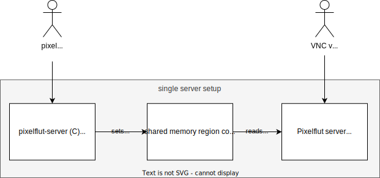

# pixelflut-v6

This README starts with running instructions.
To get background information on the history of pixelflut as well as design aspects of the "new" pixelflut v6/pingxelflut protocol please read on [Architecture](#architecture) and [History](#history).

## Running

### Prepare system

First you need to install DPDK on your system.
I can recommend the [DPDK docs](http://doc.dpdk.org/guides/linux_gsg/index.html) for this.

Afterwards list the available NICs.
Please note that `dpdk-devbind.py` is a tool from DPDK, which should be in your `$PATH` when you installed DPDK correctly.

```bash
dpdk-devbind.py --status

Network devices using kernel driver
===================================
0000:01:00.0 '82599ES 10-Gigabit SFI/SFP+ Network Connection 10fb' if=enp1s0f0 drv=ixgbe unused=
0000:01:00.1 '82599ES 10-Gigabit SFI/SFP+ Network Connection 10fb' if=enp1s0f1 drv=ixgbe unused=
0000:02:00.0 '82599ES 10-Gigabit SFI/SFP+ Network Connection 10fb' if=enp2s0f0 drv=ixgbe unused=
0000:02:00.1 '82599ES 10-Gigabit SFI/SFP+ Network Connection 10fb' if=enp2s0f1 drv=ixgbe unused=
0000:03:00.0 'MT27520 Family [ConnectX-3 Pro] 1007' if=enp3s0d1,enp3s0 drv=mlx4_core unused=
0000:07:00.0 'AR8161 Gigabit Ethernet 1091' if=enp7s0 drv=alx unused= *Active*
```

Please consult the DPDK documentation on how to get DPDK running and your NICs binded to it.
The following are the steps I'm doing on my very old Desktop:

```bash
sudo bash -c 'echo 1024 > /sys/devices/system/node/node0/hugepages/hugepages-2048kB/nr_hugepages'
sudo modprobe vfio-pci
# Yes, I have a very old CPU. You probably don't need/want that
sudo bash -c 'echo 1 > /sys/module/vfio/parameters/enable_unsafe_noiommu_mode'
sudo dpdk-devbind.py --bind=dpdk-devbind.py --bind=vfio-pci 0000:01:00.0
# Also bind other NICs
```

### pixelflut-v6-server

```bash
cd dpdk-server
make && sudo build/pixelflut-v6-server --file-prefix server1 -l 0 -a 0000:01:00.0
```

The `--file-prefix server1` argument is needed to run multiple DPDK programs in parallel.

The `-l 0` argument tells DPDK which virtual core the program should run on.
Ideally you isolate the core from the kernel using the Linux boot parameter `isolcpus` and use a core on the CPU socket the NIC is connected to (see [DPDK docs](http://doc.dpdk.org/guides/linux_gsg/nic_perf_intel_platform.html)).

The `-a 0000:01:00.0` allow-lists the NIC with the specific PCIe address.
Please note that `pixelflut-v6-server` currently only supports a single NIC port, so you need to specify exactly one `-a` argument.
If you have multiple pots, please start a dedicated server per port.

Now you should have a `pixelflut-v6-server` running and waiting for packets.
You can start additional servers for every NIC port your server has (e.g. using `sudo build/pixelflut-v6-server --file-prefix server2 -l 1 -a 0000:01:00.1`).

### breakwater

Before we can start `pixel-fluter`, we need a pixelflut server where we can flut the screen to.
For this I would recommend using breakwater and enabling the `binary-pixel-sync` feature for maximum performance.

```bash
git clone https://github.com/sbernauer/breakwater.git
cd breakwater
cargo run --release --all-features -- --width 1920 --height 1080
```

See https://github.com/sbernauer/breakwater for installation instructions in case of problems.

### pixel-fluter

```bash
cd pixel-fluter
cargo build --release && sudo target/release/pixel-fluter --pixelflut-sink 127.0.0.1:1234
```

In case you are using multiple servers, you need to restrict the screen area fluted to the pixelflut sink.
However, this still needs to be implemented - but it should be no big deal.

Once running it also prints some stats to the screen:


### pixelflut-v6-client

Let's generate some traffic:

```bash
cd dpdk-client
make && sudo build/pixelflut-v6-client --file-prefix client1 -l 2 -a 0000:02:00.0 -- --image testimage.jpg
```

## Architecture

For performance reasons both - the server and the client - are using [DPDK](https://www.dpdk.org/).
DPDK is a tool which controls your network interface card (NIC) from userspace, which gains very high performance.
The downside is that it requires you to have a [supported NIC](http://core.dpdk.org/supported/) and it's a bit more complicated to set up.
I'm e.g. using a Intel 82599 dual port 10G card for 22,00 €, which can handle ~28 million packets/s combined.

DPDK is written in C, so it makes things much easier to write your program in C as well.
As I'm miserable at C, I only wrote the code using DPDK in C, the rest in Rust.
The C `pixelflut-v6-server` opens a shared memory region, which the Rust `pixel-fluter` connects to.
This way we can not only efficiently share the framebuffer (and some statistics) between the C and Rust program, but also start multiple `pixelflut-v6-server` on the same machine sharing the same framebuffer.

The `pixel-fluter` in turn fluts the screen to a regular pixelflut server (such as breakwater).
This allows us to not re-invent the wheel and writing code for VNC, ffmpeg and such.
The biggest benefit however is that in a multi-server setup we need to have a way of combining multiple framebuffers into one shared one.
And what would be a better protocol than Pixelflut for that? :)
Please note that for CPU performance reasons a new `PXMULTI` command [was added to breakwater](https://github.com/sbernauer/breakwater/pull/34), which allows setting parts of the screen using highly efficient `memcp` operations.
So this works for best with breakwater, but `pixel-fluter` also supports the not so efficient `PB` or `PX` commands. 

### Single server setup



The setup might seem a bit complicated for a single server, but it's rather flexible.
You can easily start multiple `pixelflut-v6-server` to support reading from multiple NICs (the servers will share the framebuffer using a shared memory region).

Also you can use multiple servers as show below.

### Multiple servers setup


The sky is the limit, join as many servers as you want!
Each server can have as many NICs as you want.

On very important point is that the screen needs to be split in a way that every pixel packet is routed to exactly one server!
If multiple servers handle the same pixel we would not be able to fairly combine the screen from multiple servers.
This is achieved by splitting the `/64` network into e.g. 16 `/68` subnets.
Every NIC get's one of the `/68` subnets routed (according to the picture), in fact splitting the screen into 16 boxes horizontally (bit 65 following are the x coordinate of the pixel).
`pixelflut-v6-server` in turn needs to be informed about which pixel area it is responsible for and will only flut that specified area.

## History

> **_NOTE:_** The section might be partially wrong, as I might missed certain dates or implementations, but I hope the overarching concepts are correct.
> I'm very happy about pointing out wrong/missing facts and PRs!

### ASCII Pixelflut (2012)

The oldest mention of Pixelflut I could find was in the repo https://github.com/defnull/pixelflut dating back to 2012.
It's the original protocol sending ASCII commands over TCP in the form of `PX 123 4567 ffffff`, so let's call it ASCII Pixelflut.

There are some really fast implementations written in C and Rust (e.g. shoreline, breakwater and others).
At GPN22 we reached 130 Gbit/s using real clients (so no loopback involved) on an dual socket AMD EPYC system with 128(?) cores using breakwater.

The problem with this protocol is that the clients have an very easy job: In case you are fluting a static image, just calculate the `PX` commands in memory once and just `memcp` them into the TCP socket in a loop.
This is computationally cheap, so my Laptop can generate the 130 Gbit/s of traffic mentioned above.
However, the server needs to actually parse the ASCII commands the clients are sending, which is computationally much more expensive and also have the needed memory bandwidth to store the pixel framebuffer.

This highlights the following problems of the protocol:

1. On Laptop can saturate the biggest server we could get
2. Not even can a single client easily saturate the server, there are multiple of them hitting a single server!
   The problem can not be easily distributed over multiple servers, as every TCP packet can contain multiple `PX` commands for all possible pixels on the screen.
   Because of this you can not easily shard the traffic by e.g. screen areas without the need that every server needs to parse all traffic and forward `PX` commands to the correct server.
   This get's especially hard once you want to handle read requests.
3. The format is as easy as possible for clients, but actual parsing is required on the server side due to the fact that x and y coordinates can be 1 to 4 characters long.
   Try to write an efficient SIMD code to parse the PX commands and you will probably understand my point ;)
This results in the fact that 99% of the time the server is the bottleneck on events.
Either because it does not have more network connectivity or because it is too slow.
This results in clients not needing to optimize - you get e.g. only 10 TCP connections and once the server reached it's maximum speed there is no point in further optimizing your client - your client's performance doesn't matter any more.
Small side note: That's one of the reasons why I have never written any meaningful client but mostly focused on writing fast server implementations ;)

### Binary Pixelflut (2022)

To address the problem 3.) above a special binary command `PB` was introduced in [this commit](https://github.com/timvisee/pixelpwnr-server/commit/e22983a64b9fc5e025cde7b21f574e5881797c62), which is documented [here](https://github.com/timvisee/pixelpwnr-server?tab=readme-ov-file#the-binary-px-command).
It has the format `PBxyrgba` and encodes x, y and rgba as bytes directly instead of converting them to variable length ASCII texts.
That has the big benefit that the server does not need to do any parsing, but can take the bytes following `PB` and directly use them.

### pixelflut v6 (2017)

> **_NOTE:_** I'm calling this pixelflut v6 rather than pingxelflut, to leave this name to the next item on this list

At GPN17 a completely new [protocol](https://entropia.de/GPN17:Pingxelflut) was invented.
It does not use TCP any more, instead one network packet colors one pixel.
One funny thing is that the x, y and rgba are *not* encoded in the IP packet's payload, but in the IPv6 address instead.

It has the following benefits in comparison to the ASCII Pixelflut:

1. Very easy to parse format
2. Normal operating systems (such as the Linux kernel) are limited by how many packets/s they can process.
   This means all traffic levels are really slow when you are writing a good old userspace program.
   My hope is that we spend the effort of using some magic on the server to avoid this limitation and most clients still using the kernel and being limit by their own CPU - which would be great as it would motivate clients to optimize.
3. Multiple servers can be used to distribute the load across.
   This is achieved by not routing an /64 to a single server, but by splitting the /64 into two /65 and routing them to two different servers.
   As the 65th bit is the first bit of the x coordinate, the first servers handles left side of the screen and the second server handles the right side of the screen.
   This concept can be used to distribute the load to any power of two number of servers (at a maximum having a dedicated server for each pixel ^^).

### pingxelflut (2024)

At GPN22 some people gathered to design a new protocol based purely on ICMP messages in https://github.com/kleinesfilmroellchen/pingxelflut/.
The protocol encodes the command ("set the pixel") as well as the x, y and rgba binary within the ICMP payload and is therefore easy to parse by the server.

It's pretty similar to the pixelflut v6 protocol, just a little bit less crazy (as payload is payload) ;) and has the downside of not being able to shard the traffic across multiple servers.

### Revamp of pixelflut v6 (2024)

I was very happy with the state of my pixelflut v6 implementation back in 2020, but everyone told me that there is no way of running such crazy packet rates at events such as the GPN or congress, as it would cause problems with the network infrastructure.
So I closed the chapter as a very interesting thing I heave learned a lot from, but as not being used in real life.
However, my interested was raised again, after seeing the Pixelflut setup using dedicated switches at GPN22 to do interfere with regular traffic.

The result of this is this repository :)
